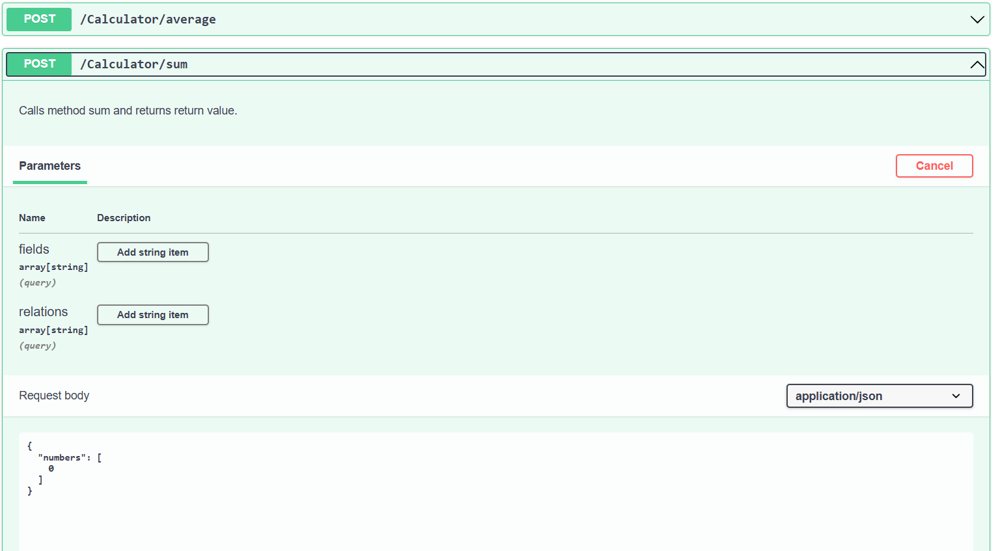
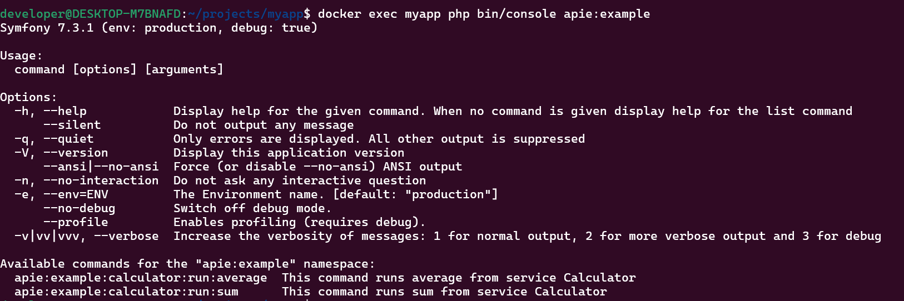
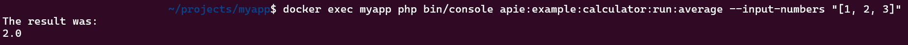
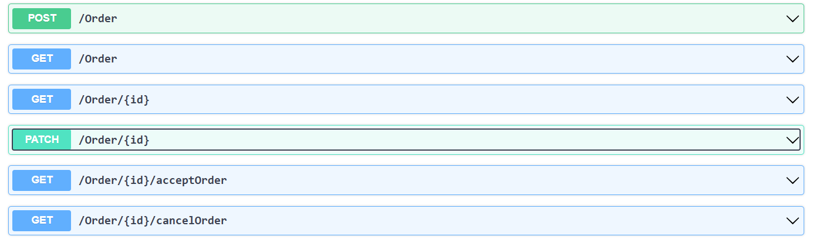

# 2. Quick Start and Basic Usage
The simplest setup is with the Docker setup. All you need is docker to set it up. Create a docker-compose.yaml and an empty domains folder:
```yaml
services:
  app:
    image: apieprogrammer/apie:symfony-cli-8.4
    container_name: myapp
    environment:
      APP_ENV: dev
    ports:
      - "8000:8000"
    volumes:
      - ./domains:/app/domains
    networks:
      - application

networks:
  application:
```
Just call this in the terminal:
```bash
mkdir -p domains
docker-compose up -d
```
And we have a working REST API!

### Basic Usage
In our basic usage I assume you have installed it with Docker as mentioned above and have a domains folder where we can put domain objects.
In Apie we can add endpoints in 2 possible ways: actions and resources.

## Add an action
We could just add an action like this:
```php
// domains/Example/Actions/Calculator.php
<?php
namespace Domains\Example\Actions;

use Apie\Core\Lists\StringHashmap;
use Apie\Serializer\Exceptions\ValidationException;

class Calculator
{
    public function sum(float... $numbers): float
    {
        return array_sum($numbers);
    }

    public function average(float... $numbers): float
    {
        if (empty($numbers)) {
            throw new ValidationException(new StringHashmap(['0' => 'First number is required!']));
        }
        return array_sum($numbers) / count($numbers);
    }
}
```
If we go to localhost:8000/api/example we get an OpenAPI spec:


Also if we run this in a terminal we can see we can also call it interactively:

```bash
docker exec myapp php bin/console apie:example
```


So we can call this method call from the terminal as well to get a result:

```bash
docker exec myapp php bin/console apie:example:calculator:run:average --input-numbers "[1, 2, 3]"
```


## Resources
Apie has also full support for domain objects. We can make CRUD actions available by creating an entity in the Resources folder.
The package apie/maker adds a console command to create an entity from the console to start with the scaffolding:

```bash
docker exec myapp php bin/console apie:create-domain-object -b example Order
```
This will create two files: an Identifier class and an Entity class.

If we check the OpenAPI spec, we see we can create and get orders:


If we want to have a PUT, we need an id in the constructor
If we want to have a PATCH, we need a setter method or a public property.
If we want to have a DELETE, we need a RemovalContext attribute on it.

We are going to make our domain object really a domain object so we do not use string, int or float as typehints, but use value objects and enum classes instead. If we want a proper Order domain object we should just use value objects and restrict the value object to only use valid values.

Let's make a regular PHP enum for OrderStatus:
```php
<?php

namespace Domains\Example\Enums;

enum OrderStatus
{
    case Draft;
    case Accepted;
    case Canceled;

    public function toAccepted(): OrderStatus
    {
        if (OrderStatus::Draft === $this) {
            return OrderStatus::Accepted;
        }

        throw new \LogicException('Order is in status "' . $this->name . '" and can not be accepted');
    }

    public function toCanceled(): OrderStatus
    {
        if (OrderStatus::Canceled !== $this) {
            return OrderStatus::Canceled;
        }

        throw new \LogicException('Order is in status "' . $this->name . '" and can not be canceled');
    }
}
<?php
// domains\Example\Enums\OrderStatus.php
namespace Domains\Example\Enums;

enum OrderStatus
{
    case Draft;
    case Accepted;
    case Canceled;

    public function toAccepted(): OrderStatus
    {
        if (OrderStatus::Draft === $this) {
            return OrderStatus::Accepted;
        }

        throw new \LogicException('Order is in status "' . $this->name . '" and can not be accepted');
    }

    public function toCanceled(): OrderStatus
    {
        if (OrderStatus::Canceled !== $this) {
            return OrderStatus::Canceled;
        }

        throw new \LogicException('Order is in status "' . $this->name . '" and can not be canceled');
    }
}
```

And this becomes our Order domain object:

```php
<?php

namespace Domains\Example\Resources;

use Apie\CommonValueObjects\Email;
use Apie\Core\Entities\EntityInterface;
use Apie\CountryAndPhoneNumber\BelgianPhoneNumber;
use Apie\CountryAndPhoneNumber\DutchPhoneNumber;
use Domains\Example\Enums\OrderStatus;
use Domains\Example\Identifiers\OrderIdentifier;

class Order implements EntityInterface
{
    private OrderIdentifier $id;
    private OrderStatus $orderStatus;

    public function __construct(
        private Email $email,
        public DutchPhoneNumber|BelgianPhoneNumber|null $contactPhone = null
    ) {
        $this->id = OrderIdentifier::createRandom();
        $this->orderStatus = OrderStatus::Draft;
    }

    public function getId(): OrderIdentifier
    {
        return $this->id;
    }

    public function getOrderStatus(): OrderStatus
    {
        return $this->orderStatus;
    }

    public function acceptOrder(): Order
    {
        $this->orderStatus = $this->orderStatus->toAccepted();

        return $this;
    }

    public function cancelOrder(): Order
    {
        $this->orderStatus = $this->orderStatus->toCanceled();

        return $this;
    }

    public function getEmail(): Email
    {
        return $this->email;
    }
}
```

This will result in even more endpoints: 



So Apie does these things out of the box without you have to think about it.
- It adds an acceptOrder endpoint to call acceptOrder on a domain object. It will be persisted in the database afterwards.
- It adds a cancelorder endpoint to call cancelOrder on a domain object. It will be persisted in the database afterwards.
- Email is a value object that only allows valid e-mail address strings. It will give a validation error if it is not valid.
- DutchPhoneNumber and BelgianPhoneNumber are value objects that only accept Dutch or Belgian phone numebrs respectively.
- The field contactPhone is a public property, so mutable which adds the PATCH endpoint. It is also optional in the Order constructor, so it is not required on creation.
- because field contactPhone is public, we can filter on the column in GET /Order. Good to know: a user can search on the E164 format (+31611223344) or national format (0611223344) to find the phone number.
- because we have a getter getEmail, we can filter on the column in GET /Order

In a nutshell that is what Apie does. We could add order lines next and add permission checks afterwards. But it gives you an idea how Apie works.